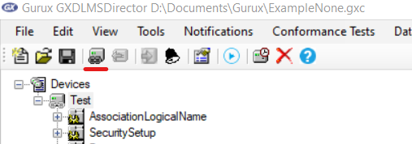

# DLMS_Example
Пример реализации DLMS сервера для компилятора GCC

Источник: https://github.com/Gurux/GuruxDLMS.c

Для проверки работы использовать [DLMS Director](http://www.gurux.fi/Download)

## Настройка DLMS Director

1. Добавить модель: 

    

2. Настроить подключение:
    * Для уровня доступа High:

        

    * Для уровня доступа Low:

        

    * Для уровня доступа None:

        

3. Подключиться:

    

### Файлы готовых настроек

* [ExampleHigh.gxc (Для уровня доступа High)](/Resources/ExampleHigh.gxc)

* [ExampleLow.gxc (Для уровня доступа Low)](/Resources/ExampleLow.gxc)

* [ExampleNone.gxc (Для уровня доступа None)](/Resources/ExampleNone.gxc)